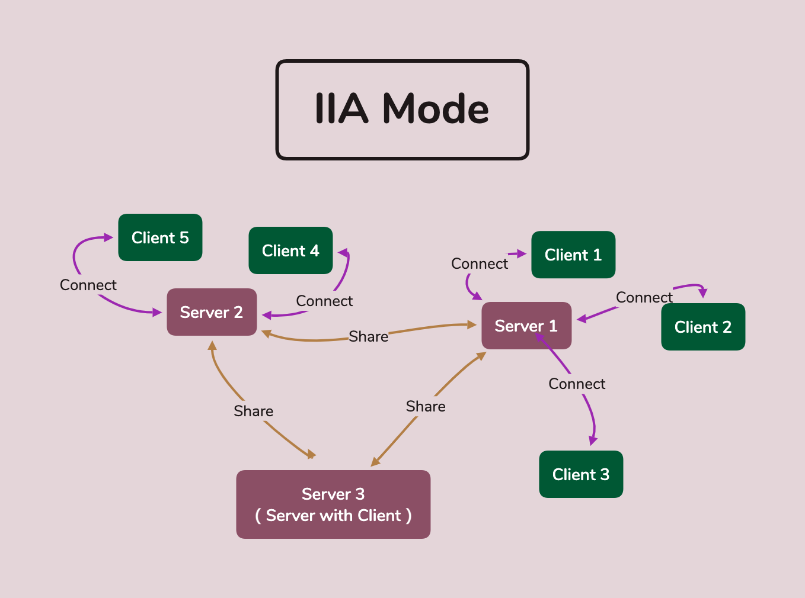

# IIA3.0  
## 需要的环境  

### Running
threading (标准库)  

### System
os (标准库)  

### UI  
os (标准库)  
sys (标准库)  
PyQt5 (第三方库)  

### Socket  
json  (标准库)  
socket  (标准库)  
os  (标准库)  
random  (标准库)  
websocket_server (第三方库)  

## IIA项目架构
### 顶层模块
* server - 服务器模块
* ui - 界面模块
### 功能模块
* mission - 任务模块
* reminder - 提醒事项模块
* warehouse - 数据仓库模块
* mapping - 导图模块
* process - 数据处理模块
* template - 模板模块
* show - 展示模块
* auxiliary - 辅助模块
### 底层模块
* storage - 存储模块
* logger - 记录模块

## IIA系统逻辑
### 运行模式
__本地运行__: 设备单机运行, 需要在本机注册账户, 账户只在本机可用。  
__仅服务器端运行__: 本设备单机运行, 可以作为局域网或广域网内的服务器提供连入与远程操作功能。  
__服务器端运行__: 在仅服务器端运行的基础上, 本机同时运行客户端部分连入本地服务器。  
__共享模式__: 本地运行或服务端运行的主机可以开启共享模式, 让同样开启共享模式的设备访问与共享指定数据。  
   

### 三个系统
三个系统都可以由用户自己运行，IIA提供官方运行的云服务器，但是用户也可以构建自己的云服务器。
* __服务器系统__ : 进行数据存储，分析，查找等主要工作。
* __客户端系统__ : 连接特定服务器系统，进行展示。提供交互媒介。
* __云社区系统__ : (待定)提供云数据库支持，提供社区功能。
### 账户
每个用户需要输入邮箱来确定一个账户, 邮箱与账户一一对应。
### 仓库
* __数据仓库__: 数据仓库是工作区的基本单位。  
* __数据仓库可见__: 每一个数据仓库会标识账户属性, 您可以设置仅自己可见, 仅部分好友可见或全部可见。  
* __数据仓库版本__: 数据仓库对应一个本地版本树, 您可以进行版本控制。  
* __设备同步__: 数据仓库可以上传到指定IP的服务器上, 当然您需要提前在目的服务器上注册同样的用户信息。

