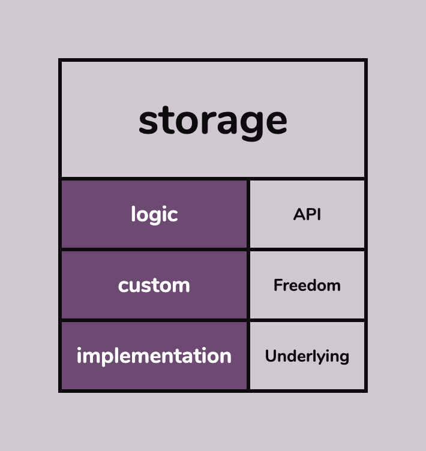
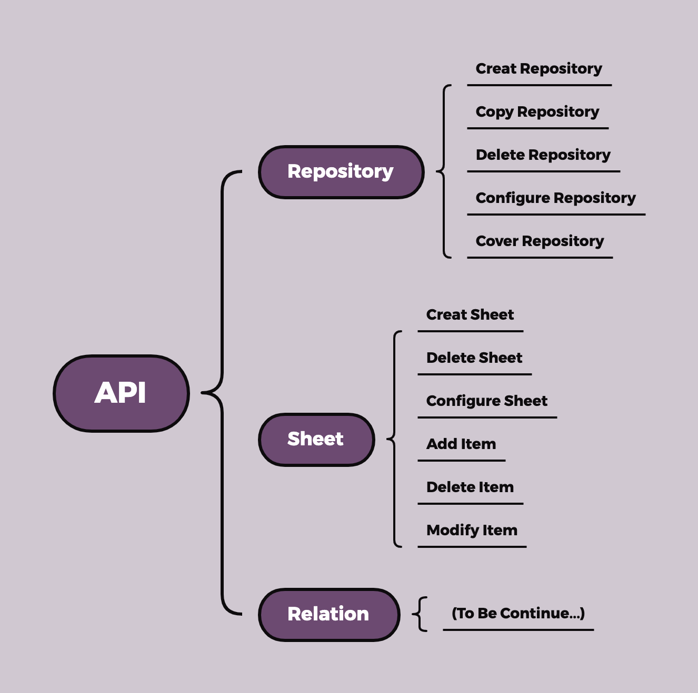
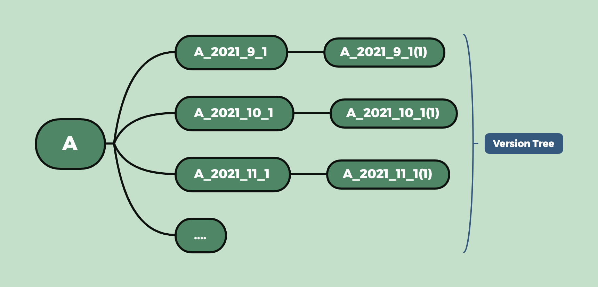

# Storage Module Document
## 1. Overview
The storage module is designed into three layers: **logic layer**, **custom layer** and **implementation layer**.  

   

The storage module is designed into three layers: logic layer, custom layer and implementation layer.  

The logical layer is mainly responsible for constructing the logical representation of the data, providing the basic necessary operations, and does not pay attention to the concrete implementation.  

The customization layer is responsible for implementing specific, concrete, highly variable content and allowing users to add their own plug-ins. The custom layer is the implementation scheme of logical layer.  

The implementation layer is concerned with transforming a logic-level solution into a storage-oriented implementation.  

The implementation layer provides many small modules, and the logic layer and the custom layer call these small modules for operations, so as to achieve the separation of logic and implementation.  

## 2. Logic Layer
### 2.1 Logic Layer Overview
The data type currently provided: **Repository**, **Sheet**, **Relation**.  

Repository is a piece space for specific kind of data. In the repository, the sheet could have relationship with each other and that's what we care about.  

Sheet is a unit in repository, we can input some highly structured data in the sheet.

Relation, after input data in the sheet, we maybe want to improve efficiency and reduce storage space. This step we need define relationship between sheets.

   

### 2.2 Repository
1. __What is Repository__  
A Repository is a unit of work. For example, if you want to create a ledger for billing management, you can create an account repository. If you want to analyze your company's financial performance over the years, you can create a company revenue repository.  

2. __Repository Name__  
Each repository (including backup repositories) has its own unique name. This conflicts when considering network synchronization. (For example, if you create A local warehouse on device A and synchronize it to server B, then create A data warehouse with the same name on device C and connect to server B, then there will be A name conflict and synchronization cannot occur. You need to change the name of the local warehouse to avoid the conflict.)

3. __Version Control__  
Each new warehouse you build can be viewed as a seed that can grow a tree. This tree is called the "version tree." We can use it for backups and version fallbacks.  
For example, repository A is important to you and changes frequently in order to avoid errors or catastrophic failures. You can set up A backup of A at A certain time, and when A fails, fall back to the latest version, reducing losses.
   

### 2.3 Repository API
1. __Creat Repository__  
``` Python
import storage
storage.creat_repository(name='RepoTest')
```
2. __Copy Repository__  
``` Python
import storage
storage.copy_repository(name='RepoTest_2021_7_1',old_name='RepoTest')
```
3. __Delete Repository__  
``` Python
import storage
storage.delete_repository(name='RepoTest_2021_7_1')
```
4. __Configure Repository__  
``` Python
import storage
# Check if repository 'RepoTest' has a cloud copy
storage.configure_repository(name='RepoTest',con_name='cloud')
# Change configure or add a self-defined label
storage.configure_repository(name='RepoTest',con_name='tag1',con_content='New!')
```
5. __Cover Repository__  
``` Python
import storage
storage.cover_repository(from_name='RepoTest_2021_7_6',to_name='RepoTest')
```

## 3. Custom Layer
### Repository
1. Each repository have it's id(repo_id). 
Each data warehouse has an ID(repo_id), which is used to record the backup relationships between repositories. When there is no backup exists, the repo_id is like '[0]', '[1]', and so on. When a copy of '[1]' bron, its repo_id is '[1, 0]', that's because its the first copy of '[1]'. In the same way, the copies of '[1,0]' are '[1, 0, 0]', '[1, 0, 1]' and so on.  

2. Each repositroy have it's name.
In IIA, **the repository can not have the name** with each other. In another word, name of repository is another ID for each repository which is more oriented to users.  

3. Each repositroy has option if_exist.
Beacuse the repository can be copied. When a repository is deleted, there maybe have several copies of it. If we just delete the repository simplily, we could loss the full relationship of repositories. So when a repositroy is deleted, the data in it would be cleared but the id of it will be kept, unless all the copies of it be deleted. If the file is deleted, 'exist' option equals True, else, equals Flase.  

4. Each repositroy has option if_cloud. 
If the warehouse has been uploaded to the cloud, or the warehouse has been downloaded from the cloud, it will be marked: if_cloud = True.

## 4. Implementation Layer