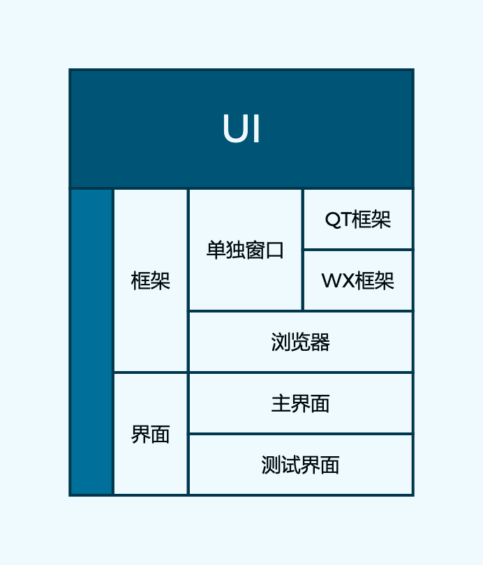

# UI MODULE DOCUMENT

[返回主菜单](../README.md)



## 1. Overview

`ui`模块不仅负责界面的定义，还要负责界面的展示，所以http服务器包含于`ui`模块中。

* UI模块负责程序的界面与界面展示。
* UI模块分为两部分，第一部分为进行界面展示框架，第二部分是界面代码。

## 2. UI Implement

界面通过HTML+CSS+JS进行构建，通过websocket进行与主进程的通信。

## 3. UI Display frame

UI展示框架有两种，PyQt5框架与wxpython框架，另外用户也可以选择通过浏览器打开。

* __Import__  

``` Python
import ui
```

You should import `ui` module to use ui api.  

* **Run**

```python
ui.run(HTML_PATH,TEST_PATH,TEST_MODE,OPEN_WIN,OPEN_WEB,SHARE,80_PORT)
```

HTML_PATH： UI模块默认打开的HTML文件路径

TEST_MODE：是否进入测试模式

OPEN_WIN：是否通过桌面应用打开

OPEN_WEB：是否通过默认浏览器打开

SHARE：是否开放局域网

80_PORT：是否默认使用80端口